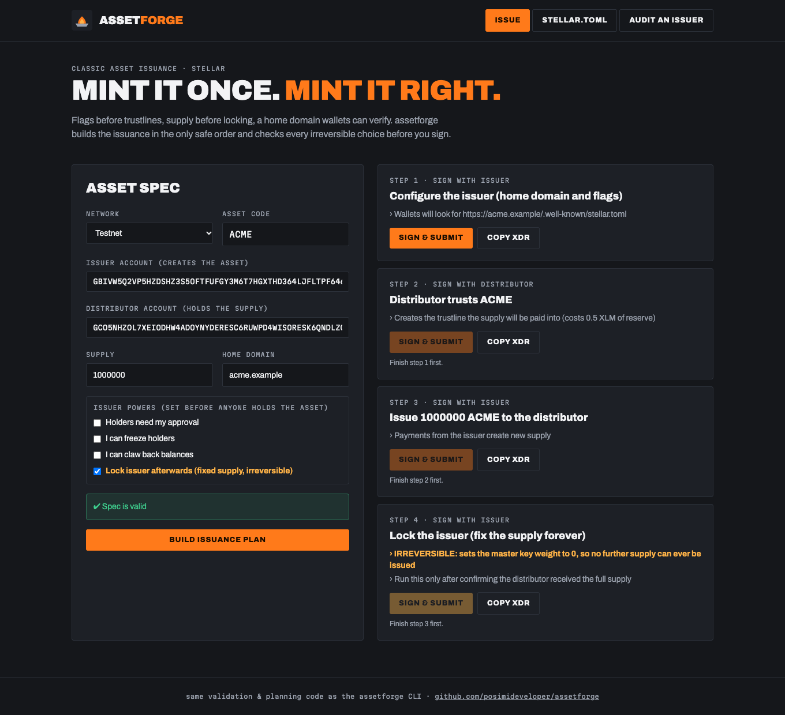

# assetforge

**Issue a Stellar asset the right way, the first time.**

Issuing a classic Stellar asset takes four steps that must happen in the
right order. Several mistakes are permanent:

- setting clawback **after** holders already have trustlines (it won't apply to them)
- holding supply in the issuer account (it can't hold its own asset)
- forgetting the home domain, so wallets show the asset as unverified
- locking the issuer **before** the full supply has been sent, so you can never mint the rest

`assetforge` turns one JSON config into the correct, ordered, **unsigned**
transactions, generates the `stellar.toml` wallets need to display your
asset, and audits any existing issuer for common problems.

## 1. Describe the asset

```json
{
  "network": "testnet",
  "code": "ACME",
  "issuer": "G…ISSUER",
  "distributor": "G…DISTRIBUTOR",
  "supply": "1000000",
  "homeDomain": "acme.example",
  "lockIssuer": true,
  "flags": { "authRequired": false, "authRevocable": false, "clawbackEnabled": false },
  "toml": { "name": "Acme Credits", "desc": "Loyalty credits", "orgName": "Acme Ltd", "orgUrl": "https://acme.example" }
}
```

The config is validated before anything is built. It rejects bad codes
and keys, issuer = distributor, supply above Stellar's maximum or with
more than 7 decimals, clawback without revocable, and a locked issuer
combined with auth flags (which could never be used).

## 2. Plan the issuance

```console
$ assetforge plan acme.json

Step 1: Configure the issuer (home domain and flags)  (sign with: issuer)
  • Wallets will look for https://acme.example/.well-known/stellar.toml
  AAAAAgAAAAB…

Step 2: Distributor trusts ACME  (sign with: distributor)
  • Creates the trustline the supply will be paid into (costs 0.5 XLM of reserve)
  AAAAAgAAAAA…

Step 3: Issue 1000000 ACME to the distributor  (sign with: issuer)
  AAAAAgAAAAB…

Step 4: Lock the issuer (fix the supply forever)  (sign with: issuer)
  • IRREVERSIBLE: sets the master key weight to 0, so no further supply can ever be issued
  • Run this only after confirming the distributor received the full supply
  AAAAAgAAAAB…
```

Sequence numbers are fetched from Horizon and assigned consecutively per
signer. Sign each XDR in your wallet or
[Stellar Lab](https://lab.stellar.org) and submit them in order.
`assetforge` never sees a secret key.

## 3. Publish stellar.toml

```bash
assetforge toml acme.json > .well-known/stellar.toml
```

This produces `NETWORK_PASSPHRASE`, `ACCOUNTS`, `[DOCUMENTATION]` and a
`[[CURRENCIES]]` entry with `fixed_number` / `is_unlimited` set from
`lockIssuer`. Serve it at `https://<homeDomain>/.well-known/stellar.toml`
with `Access-Control-Allow-Origin: *`.

## 4. Audit any issuer

```console
$ assetforge audit G…ISSUER --code ACME
✔ Issuer is locked: no key can sign, so supply is fixed forever
✔ Holders can't be frozen or clawed back
✔ Home domain is acme.example
✔ stellar.toml lists this issuer
```

Use it on your own issuer after launch, or on someone else's before you
trust their token. It checks lock status, single-key control, freeze
and clawback powers, the home domain, and whether `stellar.toml` is
reachable and lists the issuer and asset. Exit code `2` means at least
one check failed.

## Library

```ts
import { validateConfig, buildPlan, generateToml, auditIssuer } from "assetforge";
const steps = buildPlan(validateConfig(config), { issuer: "123", distributor: "456" });
```

## Development

```bash
npm install
npm test        # 21 tests: validation, plan order/sequences/ops, toml, audit, CLI
npm run lint && npm run typecheck && npm run build
```

## Web app



An issuance studio at `web/`, using this package's validation, planning, toml and audit code in the browser:

- **Issue**: describe the asset (network, code, issuer, distributor, supply, home domain, issuer powers, lock) with live validation of every irreversible choice. Build the plan with sequence numbers from Horizon, then **sign & submit each step with Freighter** in order, or copy the XDR to sign elsewhere.
- **stellar.toml**: fill in what wallets display (name, description, logo, organisation, asset type), then preview and download the file.
- **Audit an issuer**: lock status, single-key control, freeze and clawback powers, home domain and stellar.toml checks for any issuer on testnet or mainnet.

```bash
cd web
npm install
npm run dev        # http://localhost:5173
```

The app imports the library straight from `../src`, so the browser and the CLI
share one implementation. `netlify.toml` at the repo root deploys it as-is.

## Documentation

- [Architecture](docs/architecture.md)
- [Issuance checklist](docs/issuance-checklist.md)
- [Contributing](CONTRIBUTING.md) · [Security policy](SECURITY.md) · [Changelog](CHANGELOG.md)

## Glossary (new to Stellar?)

- **Issuer**: the account that creates an asset. Payments *from* it mint
  new supply.
- **Distributor**: a separate account that holds the supply and
  distributes it (sales, airdrops, market making).
- **Locking the issuer**: setting its master key weight to 0 so nobody
  can sign for it again, which permanently fixes the supply.
- **Trustline**: an account's opt-in to hold an asset. Every holder
  needs one.
- **Auth flags**: `AUTH_REQUIRED` (holders need approval),
  `AUTH_REVOCABLE` (the issuer can freeze holders) and
  `AUTH_CLAWBACK_ENABLED` (the issuer can take balances back).
- **Home domain / stellar.toml**: where an issuer publishes who they are,
  so wallets can show the asset's name, logo and organisation.

## License

MIT
